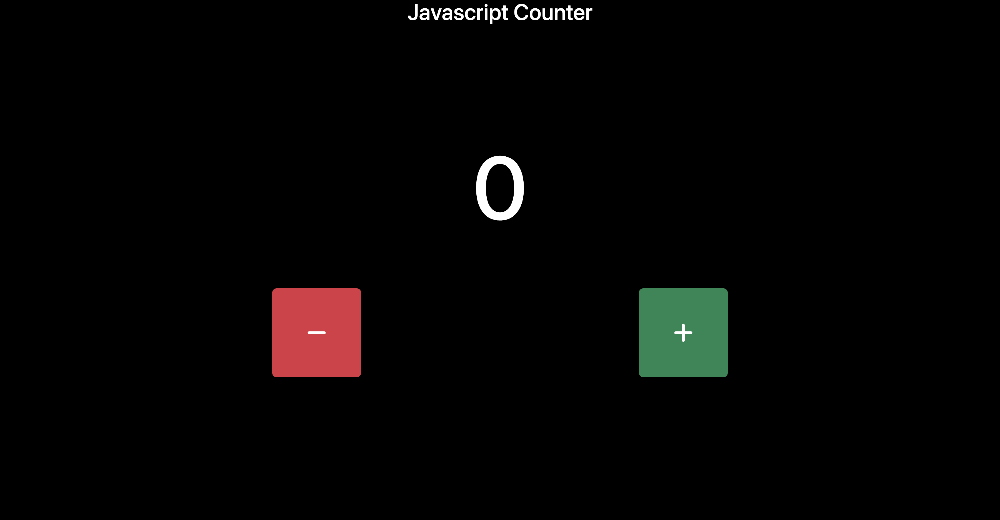

# Counter
> Progetto JavaScript Basics.

Questo progetto è stato creato per testare ciò che ho imparato in seguito allo studio della guida JavaScript Basics.  
Il progetto consiste nel creare un'applicazione che permetta all'utente di aumentare o diminuire il valore del counter a seguito dell'utilizzo di determinati pulsanti.

## Link

